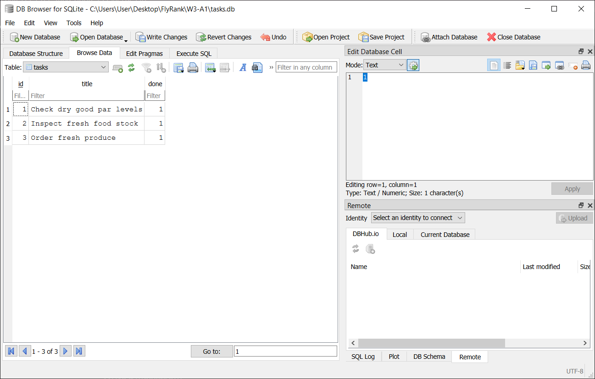

# FlyRank W2 A1
A simple CRUD application built with Express. It consists of GET, POST, PUT and DELETE API methods with custom routes.

## Features
- Stores task information in a tasks list
- Reads all tasks from the list
- Reads a single task for the provided Id
- Updates task information for a provided Id
- Deletes task matching the provided Id

## Tech Stack
- JavaScript, Express.js, SwaggerUI

## Prerequisites
- Node.js (v18 or higher)
- npm


## Installation
```
git clone https://github.com/sonuoso/flyrank-w2-a1
cd flyrank-w2-a1
npm install
```

## Usage/Running the App
```
npm start
```
- This starts the Express and will show *Server is running on port 3000.* when running successfully.

## API Reference
| **Method** | **Path** | **Description** |
| :--- | :--- | :--- |
| GET | /health | Checks if the status of the server. Running successfully - `{ "status": "ok" }` |
| GET | /tasks | Shows all the saved tasks. Response - an array of task objects. `[{ "id": number, "title": "string", "done": boolean }]` |
| GET | /tasks/:id | Shows all the information of the task for the given id in the path. Required - `id`. Returns a task object |
| POST | /tasks | Saves a task in the tasks with the given title in the request body and retuns newly created task object. Request - `{ "title": "string" }`, Response - `{ "id": number, "title": "string", "done": boolean }` |
| PUT | /tasks/:id | Updates the title and/or done status of the task matching the id in the request body with values in the request body and returns the updated task object. Request - `{ "title": "string", "done": boolean }`, Response - `{ "id": number, "title": "string", "done": boolean }` |
| DELETE | /tasks/:id | Delete the task from tasks matching the given id in the path. Required - `id` |

## Example Request
**POST /tasks**
```bash
curl -i -X POST http://localhost:3000/tasks -H "Content-Type: application/json" -d '{"title": "Inspect produce crates"}'
```

**Response** - *Example: id is 4*
```
HTTP/1.1 201 Created
X-Powered-By: Express
Content-Type: application/json; charset=utf-8
Content-Length: 54
ETag: W/"36-IVDKh8YjIHGhj93enrQ5Iva7eSg"
Date: Thu, 16 Jul 2026 07:37:37 GMT
Connection: keep-alive
Keep-Alive: timeout=5

{"id":4,"title":"Inspect produce crates","done":false}
```

## API Documentation (Swagger)
Once the server is running, visit `http://localhost:3000/docs`. It will show all the API route along with the option to test routes and inspect responses visually.


## The Mortality Experiment
A new task with `{ title: "Check produce crates" }` created using `POST` returned the new task with the automatically assigned `id = 4` but when the server restarted and called `GET` on all tasks, it only had 3 tasks with the maximum id value being 3. Since tasks are saved to an in-memory array on the running server and upon restart, tasks array is reverted to its default values discarding changes.

## AI vs Me (W2 A1)

### Prompt
```
Objective: Build a simple CRUD application to test out different custom routes with GET, POST, PUT and DELETE API methods.

Tech Stack: JavaScript, Node.js, Express.js, SwaggerUI

Database: No databases. Just use an array called "tasks" to store objects populated with relevant task information. Use [{ id: 1, title: "Check dry good par levels", done: true }, { id: 2, title: "Inspect fresh food stock", done: true }, { id: 3, title: "Order fresh produce", done: false }] array as default when the server starts for tasks array.

Use this task object template to store tasks. { id: number, title: string, done: boolean }
Use this object template to send errors: { error: "string" }

API Endpoints:
1.	GET /health -> Returns the status whether server is running successfully. Response body: { "status": "ok" }

2.	GET /tasks -> Returns all saved tasks. Response: a JSON body with the array of tasks

3.	GET /tasks/:id -> Returns the task object in the tasks array matching the given task id. Request: id (number) in the path parameter. Response: a JSON body with the task object populated with relevant data. If no task with a matching id is not found in tasks array, set status to 404 and return an error object containing a message describing the specific issue.

4.	POST /tasks -> Saves a task object with the next available id using the title string provided by the user in the tasks array and returns the newly created task object. Request body: { title: user input string }. Response: set status to 201 and send a JSON body with the newly created task object. If given title is undefined, set status to 400 and send an error object containing a message describing the specific issue. If given title is empty, set status to 400 and send an error object containing a message describing the specific issue. If given title in request encounters any other issue than the previously mentioned two issues, set status to 400 and send an error object containing a message describing the specific issue.

5.	PUT /tasks/:id -> Updates the task object in the tasks array matching the given task id using the title and done values provided by the user. Afterwards returns the newly updated task object. Remember title and done values are optional. Request: id (number) in the path parameter. { title: user input string, done: user input boolean } in the request body. Response: a JSON body with the newly updated task object. If no task with a matching id is not found in tasks array, set status to 404 and an error object containing a message describing the specific issue. If title and done values are given but the done value is not a boolean value, set status to 400 and send an error object containing a message describing the specific issue. If only done value is given and it's not a boolean value, set status to 400 and send an error object containing a message describing the specific issue. If neither title nor done value is given, set status to 400 and send an error object containing a message describing the specific issue.

6.	DELETE /tasks/:id -> Deletes the task in the tasks array matching the given task id. Response: set status to 204 and return nothing. If no task with a matching id is not found in tasks array, set status to 404 and send an error object containing a message describing the specific issue.

*Make sure to convert id provided by the user to a number before querying the tasks array.

At path “/docs” serve a SwaggerUI instance for all the required endpoints. Write a proper openapi.json file in the root that includes suitable path, titles, descriptions, content, schema, types, examples etc. from which SwaggerUI uses to build its interactive interface.
```
### What the AI did better
#### 1. Monotonic nextId generation
In my codebase the next available id is calculated using ```Math.max()``` on the current tasks array inside the POST route function while the AI-generated version does ```let nextId = tasks.reduce((max, t) => Math.max(max, t.id), 0) + 1;``` once, outside the POST handler and later increments it with ```nextId++``` inside POST every time a task is created. When the task with the highest id value is deleted and subsequently a new task is created, my version reuses the deleted id while the AI-generated version assigns the next unused value. 

#### 2. Path parameter validation
In my GET, PUT and DELETE handlers no validation on the numerical id parameter was executed. But the AI-generated version uses ```if (Number.isNaN(id))``` to validate its type and return ```sendError(res, 400, "Task id must be a valid number.");``` on false. This subtle check catches a non-number value entered by the user and fires a 400 while my version returns with a 404 trying to query with an invalid value.

#### 3. Further DRY with OpenAPI components
I used components to build only the Task object in openapi.json but the AI-generated version created multiple components for Error messages, GET, PUT and DELETE parameters including one for Tasks. Having a component for Errors encountered helps conveniently include only a reference in a single line to that object rather than repeating the whole structure on each 400 and 404 errors.

Error component:
```
"Error": {
        "type": "object",
        "properties": {
          "error": {
            "type": "string",
            "description": "Description of what went wrong",
            "example": "Task with id 99 was not found."
          }
        },
        "required": ["error"]
      }
```

Reference:
```
"$ref": "#/components/schemas/Error"
```

Usage of such components everywhere applicable enforces DRY (Don't Repeat Yourself) concept as a proper practice.

### What it got wrong or ignored
**Skipped an instruction for Title and Done validation in PUT handler** - The ```PUT /tasks/:id``` handles validations and returns errors for two scenarios.

1. Only Done present but invalid
2. Both Title and Done present but Done invalid

My prompt mentioned both of these as two distinct scenarios but instead it validates Title and Done independently. Therefore both scenarios generate an identical error message since this approach doesn't regard Title's presence or validity as long as Done is of an invalid value.

### What my prompt left unspecified
#### 1. Improved error handling
In my prompt I deliberately opted out of specifying exact error messages for 400 and 404 on failures on different conditions and asked to return a suitable error message describing the issue upon failures. The AI-generated version wrote proper messages equivalent in intent to mine and used more practically sensible ones on some occasions.

For instance,

```
else if (req.body.title === undefined) {
    res.status(400).json({ error: "Title is missing" });
    } 

if (!task) {
    res.status(404).json({ error: `Task ${id} is not found` });
    }
```
*(My version)*

```
if (title === undefined) {
    return sendError(res, 400, "Title is required.");
    }

if (!task) {
    return sendError(res, 404, `Task with id ${id} was not found.`);
    }
```
*(AI version)*

#### 2. Added /openapi.json path
In the rematch prompt I noticed the raw openapi.json file being presented through /openapi.json path. Neither first nor second prompt specified this as a requirement yet it generated as a helpful feature.

### Unhandled instance
**Simultaneous invalid Title and Done** *(AI and Me)* - When both Title and Done are present but invalid, neither my implementation nor the AI-generated one reports the issue with a distinct error message and each only returns an error for the first encountered field quietly ignoring the other field. 

### Rematch
In the rematch prompt I explicitly stated both "done invalid" and "done invalid with title present" as separate conditions and it generated distinct error messages reflecting the encountered issues rather than using identical "done invalid" error for both cases.

## W3 A1 - Connecting to the database
### SQLite Migration
In the CRUD application built with Express in W2 A1, it used an in-memory array to handle the task data. Now the in-memory array has been swapped to a SQLite database in W3 A1 that properly stores task data and allows data retrieval and manipulation with SQL eliminating the data loss that happened upon every server restart.

SQLite requires only a single file for the database with no explicit server setup/install and is ideal for data management of a project of this scale.

All task data is stored in **tasks.db** in the root of the repository and it uses a single table to manage data. The tasks.db is also listed in .gitignore so that anyone who clones this repository on GitHub gets a fresh tasks.db automatically created with seed data without any extra manual configuration upon the initial run.

- Table: **tasks**
- Fields: **id** (integer primary key autoincrement), **title** (text not null), **done** (integer not null default 0)

(Since SQLite doesn't store Boolean values in its database, it uses `1` for `true` and `0` for `false` as values for done. When data is fetched from the tasks.db and displayed through the API, done values are changed to `true` and `false` in the repository layer for proper interpretation.)

### Exploring SQLite (Stage 4)
I ran the SQL query below in DB Browser for SQLite on tasks.db:

```sql
UPDATE tasks SET done = 1;
```
This changed the done field's value to 1 in all three tasks rendering all three tasks as completed. Afterwards I called `GET /tasks` with no server restart and it reflected the same changes made in DB Viewer through the API.

